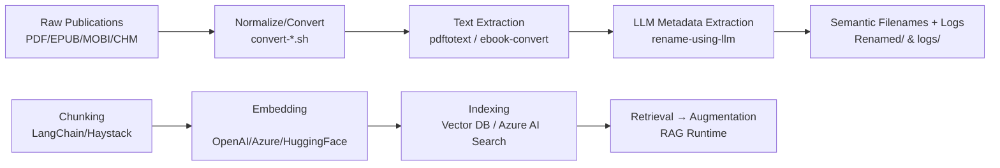

# LLM-Augmented Renaming of Publications - Ready for RAG applications

## Overview

This project provides two main approaches for renaming and organizing publications:

1. **Metadata-Based Renaming**: Uses traditional metadata extraction (title, author, ISBN) via `ebook-tools` and related scripts.
2. **LLM-Based Renaming**: Uses a Language Model (LLM) API to extract metadata from publication content and generate context-aware filenames, especially for files with poor or missing metadata.

Supported formats: PDF, EPUB, CHM, MOBI.  

**We have found this to be very useful for RAG pipelines requiring ingestion of publications (e.g., required for base domain knowledge or reflecting firm-specific research publications) that may contain missing or inconsistent metadata... and where file naming provides little or no insight re: content.**

## RAG-First Positioning and Architecture

This repository is purpose-built to prepare heterogeneous publications for high-quality ingestion into Retrieval-Augmented Generation (RAG) systems. It addresses common blockers—poor filenames, missing metadata, and mixed formats—so downstream chunking, embedding, indexing, and retrieval work reliably.

### Reference Architecture



- **Normalize/Convert:** Standardize formats to PDF where possible using provided `convert-*.sh` scripts for consistent downstream processing.
- **Text Extraction:** Use `pdftotext` (based on Poppler) and `ebook-convert` (Calibre) to produce robust plaintext.
- **LLM Metadata Extraction:** Derive semantic metadata (title, author, domain/topic, approximate date, summary) from content, not filesystem metadata.
- **Semantic Filenames + Logs:** Create collision-free, descriptive filenames and structured logs for auditability and post-processing.
- **Chunking & Embedding:** Apply windowing strategies (e.g., recursive character text splitter with overlap) and generate embeddings with your chosen model provider.
- **Indexing & Retrieval:** Store embeddings in a vector index (FAISS, Milvus, pgvector) or Azure AI Search; wire retrieval to your RAG runtime.

### Pipeline Design Notes

- **Chunking Strategy:** Prefer semantic chunking by headings with fallback to character windows (e.g., 1,000–2,000 chars, 10–15% overlap) to balance recall and precision.
- **Metadata Attachment:** Preserve source path, canonical filename, extracted title/author, and document-level summary for each chunk to improve ranking and answer grounding.
- **Deduplication:** Use the repo’s hash utilities to avoid duplicate ingestion; maintain a mapping from original → canonical name.
- **Observability:** Leverage logs in [logs/](logs/) for traceability across ingestion, conversion, and metadata extraction.
- **Idempotency:** Re-running on the same corpus should be safe; unchanged documents retain canonical names and are skipped.

### Quick Start: Prepare RAG-Ready Corpus

1. Normalize/convert formats as needed:
   ```bash
   ./convert-epub-to-pdf.sh /data/publications
   ./convert-mobi-to-pdf.sh /data/publications
   ./convert-chm-to-pdf.sh /data/publications
   ```
2. Extract semantic metadata and rename:
   ```bash
   ./rename-using-llm-langchain.py -i /data/publications -o /data/renamed -c rename-using-llm.conf
   ```
3. Organize outputs for ingestion:
   ```bash
   ./organize-ebooks.sh -i /data/renamed -o /data/rag-ready
   ```
4. Feed into your chunking/embedding/index pipeline (LangChain/Haystack/Azure AI Search).

### Integration Example: LangChain Ingestion

```python
from pathlib import Path
from langchain.text_splitter import RecursiveCharacterTextSplitter
from langchain_community.document_loaders import TextLoader, PyPDFLoader

base = Path("/data/renamed")
docs = []
for p in base.rglob("*.pdf"):
   docs.extend(PyPDFLoader(str(p)).load())
for p in base.rglob("*.txt"):
   docs.extend(TextLoader(str(p)).load())

splitter = RecursiveCharacterTextSplitter(
   chunk_size=1500,
   chunk_overlap=200,
)
chunks = splitter.split_documents(docs)

# Attach key metadata fields carried by the repo’s processing
for d in chunks:
   d.metadata.setdefault("source", d.metadata.get("source", "unknown"))
   d.metadata["canonical_filename"] = Path(d.metadata.get("source", "")).name

# Proceed with embeddings + index (FAISS/Milvus/pgvector/Azure)
```

This positions the repository as a RAG ingestion accelerator: it transforms messy, multi-format publications into semantically labeled, audit-friendly assets ready for chunking, embedding, and retrieval.

### Sidecar Metadata JSON for Indexing

To streamline downstream indexing, generate per-file sidecar JSON with canonical metadata for each publication:

```bash
./generate-sidecar-json.py -i /data/renamed -l logs -o /data/rag-ready/sidecars
```

Schema (representative):

- **source_path:** absolute path of the publication.
- **canonical_filename:** final filename used for ingestion.
- **original_filename:** pre-rename basename if available from logs.
- **file_format / mime_type / size_bytes / sha256:** technical attributes for validation and dedup.
- **title / author / publication_date:** human metadata (LLM-derived or filename-inferred).
- **summary / domain_topics:** optional semantic enrichment if present in logs.
- **llm.model / llm.endpoint / llm.confidence:** provenance of metadata extraction.
- **metadata_source:** one of `llm`, `filename`, `unknown`.
- **created_at:** ISO timestamp of sidecar generation.

Sidecars are written next to each file (e.g., `report.pdf.json`) or into `-o` if provided.

## Features

- Scans directories for supported publication files.
- Extracts text using `pdftotext` or `ebook-convert`.
- Sends extracted text to an LLM API for metadata extraction.
- Renames files using the returned metadata, with cleaning and collision avoidance.
- Converts CHM/MOBI files to PDF if needed.
- Moves unprocessable files to a "Failed" directory.
- Logs all actions and errors.
- Includes error handling and retry logic for API requests.
- Configuration via `.conf` and `config.json` files.

## Installation

1. Clone the repository:
   ```sh

   git clone https://github.com/ngpepin/LLM-rename-publications-RAG.git

   cd rename-ebooks

   ```

2. Install dependencies:
   
- `jq`
- `docker`
- `unzip`
- `poppler-utils`
- `calibre`

## Usage

### Metadata-Based Renaming

```bash
./rename-ebooks.sh [OPTIONS] -i /path/to/input -o /path/to/output
```
### Fixing Matches
```sh
./fix-matches.sh [-i /path/to/input-directory -o /path/to/output-directory]
```

### LLM-Based Renaming

```bash
./rename-using-llm.sh /path/to/books
./rename-using-llm-langchain.py -i /path/to/input -o /path/to/output -c rename-using-llm.conf
```
## Configuration

See `config.json` and `.conf` files for options and API settings.

## Contributing

Contributions are welcome! Please open an issue or submit a pull request.

## License

MIT License.
